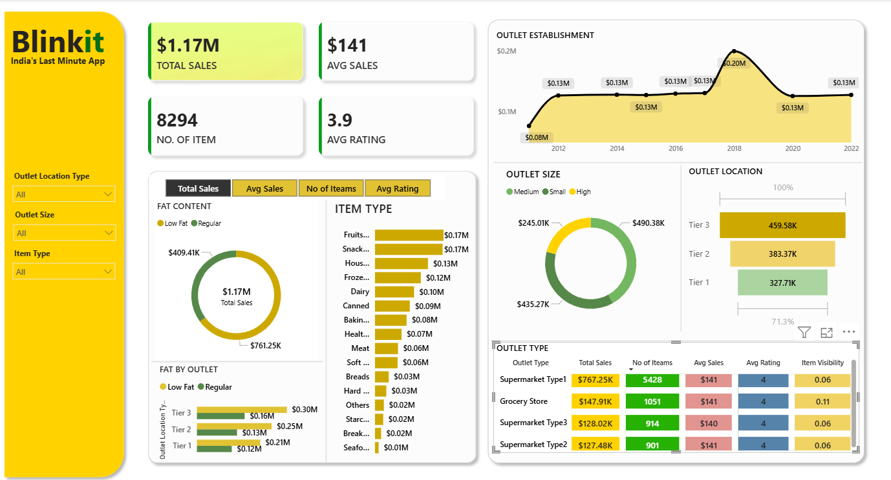
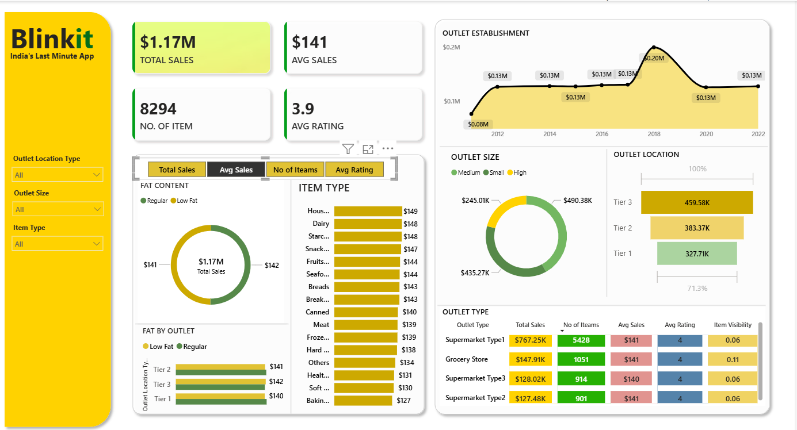
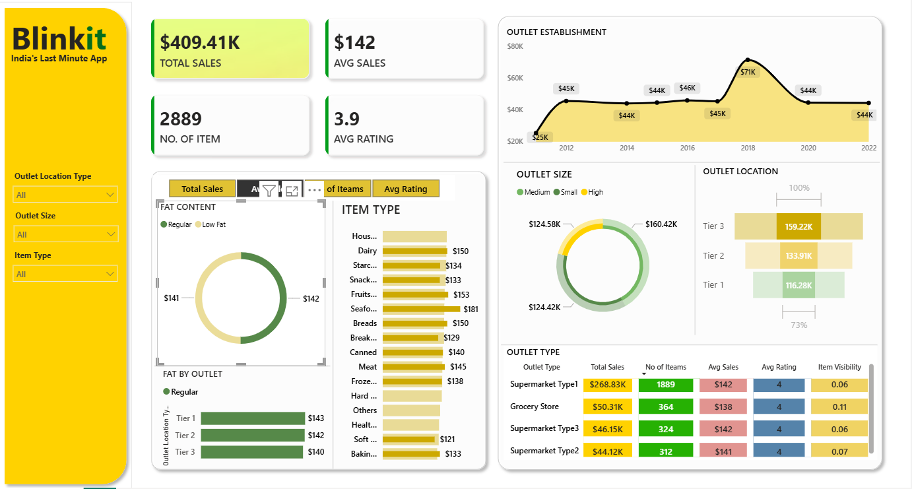

# 🛒 Blinkit Grocery Sales Dashboard


An interactive Power BI dashboard analyzing Blinkit's grocery sales data — covering
revenue trends, customer ratings, and outlet performance to surface insights that
could help with business decisions.

---

## 📌 What's in the Dashboard

**📈 Sales Performance**
- Total revenue, average order value, and pricing trends
- Top-performing grocery categories and product groups

**👥 Customer Ratings**
- How customer satisfaction ratings vary across item types
- Purchase volume patterns across product categories

**🏬 Outlet Performance**
- Breakdown by outlet size, location type (urban/rural), and how long outlets
  have been established
- Identifying underperforming outlets and possible growth opportunities

---

## 🛠️ How it was built

| Step | Tool | What it does |
| :--- | :--- | :--- |
| 🗃️ **Data Cleaning** | Power Query | Cleaning and transforming the raw data |
| 🧠 **Calculations** | DAX | Custom measures for metrics like AOV and time-based trends |
| 📊 **Dashboard** | Power BI Desktop | Building the visuals and data model |

---

## 🖼️ Dashboard Preview

<p align="center">
  
</p>
<p align="center">
  
  
</p>

---

## ▶️ How to run this locally

**Prerequisites:** Power BI Desktop installed
**Steps:**
```bash
git clone https://github.com/ArJiTa11-io/Blinkit-Grocery-Data-Analysis.git
```
Then open the `.pbix` file in Power BI Desktop.
